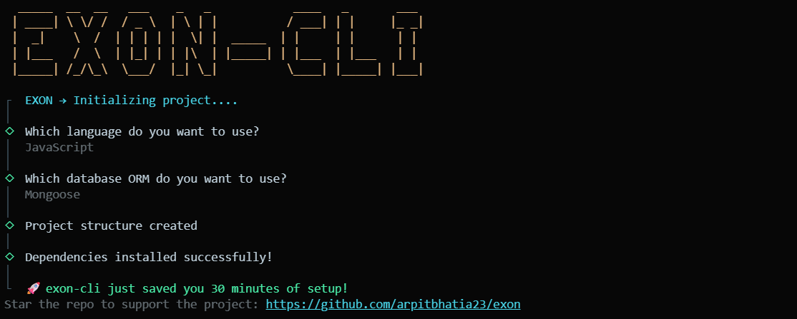

# ⚡ Exon CLI — The Modern Express Generator

[](https://badge.fury.io/js/exon-cli)
[](https://opensource.org/licenses/MIT)

**Exon CLI** is the ultimate **Express Generator** and **Express TypeScript Generator** for modern Node.js developers. Bootstrap a production-ready Express.js REST API with TypeScript, built-in Swagger documentation, Winston logging, and your choice of ORM (Prisma, Drizzle, or Mongoose) in under **30 seconds**.

If you are looking for an `express-generator` alternative that supports modern tooling out of the box, Exon CLI is built for you.

<p align="center">
  
</p>

---

## 🚀 Quick Start: Generate Your Express API

```bash
npx exon-cli create my-api
cd my-api
npm start
```

That's it! Your backend is live and Swagger API documentation is instantly available at `http://localhost:3802/docs`.

---

## ⚔️ Why Exon CLI is Better: The Ultimate Comparison

When you search for an **Express setup tool**, you usually find the classic `express-generator` or spend hours manually configuring a repository. Here is why **Exon CLI** is the better choice for modern backend development:

| Feature                            | Exon CLI ⚡                                | `express-generator` 🦖          | Manual Setup 😵           |
| :--------------------------------- | :----------------------------------------- | :------------------------------ | :------------------------ |
| **Native TypeScript Support**      | ✅ Yes, out of the box                     | ❌ No (Requires manual setup)   | ❌ 30+ mins configuration |
| **Modern ES Modules (ESM)**        | ✅ Yes                                     | ❌ No (CommonJS)                | ❌ Manual setup           |
| **Swagger/OpenAPI Built-in**       | ✅ Yes, auto-configured                    | ❌ No                           | ❌ Manual setup           |
| **Database & ORM Ready**           | ✅ Prisma, Drizzle, Mongoose               | ❌ No                           | ❌ Manual setup           |
| **Error Handling & Async Wrapper** | ✅ Yes (`asyncHandler`, structured errors) | ❌ No (Callback hell)           | ❌ Manual setup           |
| **Production Logging**             | ✅ Morgan + Winston configured             | ❌ Basic Morgan only            | ❌ Manual setup           |
| **Setup Time**                     | **30 Seconds**                             | 2 Minutes (but no modern tools) | 30–60 Minutes             |

Exon CLI acts as the "Create React App" or "Next.js" equivalent for Express APIs, saving you hours of boilerplate configuration.

---

## ✨ Core Features of this Express TypeScript Boilerplate

- **⚡ Instant Scaffold**: The fastest Node.js REST API generator available.
- **🔄 TypeScript & JavaScript**: First-class support for both an `express typescript generator` flow and a standardized JS flow.
- **📚 Auto-Generated Docs**: Ships with Swagger/OpenAPI out-of-the-box. Forget writing docs from scratch.
- **🧠 Production Logging System**: Pre-configured daily log rotation using Morgan and Winston.
- **🛡️ Bulletproof Error Handling**: Standardized `apiError`, `apiResponse`, and `asyncHandler` utilities.
- **🗄️ Database Ready**: Instantly integrate MongoDB, PostgreSQL, MySQL via **Mongoose**, **Prisma**, or **Drizzle**.
- **📦 Clean Architecture**: Highly scalable folder tree separating routes, controllers, and models.

---

## 📦 Installation

### Option 1: Use with npx (Recommended)

Generate your boilerplate instantly without installing packages globally:

```bash
npx exon-cli create my-express-app
```

### Option 2: Install Globally

```bash
npm install -g exon-cli
```

---

## 🎮 Interactive Express Generator Flow

When you run the command, Exon CLI provides an easy semantic workflow:

1. **Choose Language**: TypeScript or JavaScript.
2. **Choose Database**: Prisma, Drizzle, Mongoose, or None.
3. **Automatic Install**: Exon merges the required dependencies and runs `npm install` automatically.

---

## 📁 Highly Scalable Project Structure

Using our express generator creates a codebase that is easy to scale for enterprise apps or microservices:

```text
my-express-app
│
├── src
│   ├── controllers     # API route logic
│   ├── routes          # Express router definitions
│   ├── middleware      # Auth, validation, logging middleware
│   ├── models          # Database schemas
│   ├── helpers         # Helper logic
│   ├── db              # Database connection logic (Prisma/Mongoose/Drizzle)
│   ├── utils
│   │   ├── apiError.ts    # Standardized error class
│   │   ├── apiResponse.ts # Standardized response format
│   │   └── asyncHandler.ts# Try/catch wrapper for async routes
│   ├── app.ts          # Express app configuration
│   └── index.ts        # Entry point & server startup
│
├── package.json
├── tsconfig.json       # Pre-configured for strict modern TS
└── README.md
```

---

## 🔎 Built-in Production Utilities

### 1. Robust Async Routing

Never write endless `try...catch` blocks again. Use the built-in wrapper:

```typescript
router.get(
  "/users",
  asyncHandler(async (req, res) => {
    // any errors thrown here are automatically caught by the global error handler!
    const users = await db.getUsers();
    res.status(200).json(new apiResponse(200, users, "Success"));
  }),
);
```

### 2. Standardized Error Handling

Ensure your frontend always receives a consistent error schema:

```typescript
if (!user) {
  throw new apiError(404, "User not found");
}
```

### 3. Immediate Swagger Documentation

Visit `http://localhost:3802/docs` the second you start your app.
Just write JSDoc comments above your routes, and Swagger UI dynamically renders them!

```javascript
/**
 * @swagger
 * /api/v1/users:
 *   get:
 *     summary: Get all users
 *     responses:
 *       200:
 *         description: Success
 */
```

---

## ⚙️ Environment Configuration

Set up your database easily. Exon automatically scaffolds a `.env` boilerplate:

```env
PORT=3802
NODE_ENV=development
DB_URI=your_database_connection_string
```

---

## 🎯 Ideal Use Cases

- Building a **REST API** backend from scratch.
- Rapid prototyping for **Hackathons**.
- Starting **SaaS Backends** or **Microservices**.
- Scaffolding a **Mobile App Backend**.
- Establishing an **Express TypeScript Scaffold** standard for your engineering team.

---

## 🌍 Supported Platforms

Deploy your generated backend seamlessly to:

- AWS (EC2 / Elastic Beanstalk)
- Vercel / Render / Railway
- Docker Containers
- Google Cloud
- Heroku

---

## 🎮 Easter Egg

The default port is uniquely branded!

- E → **3**
- X → **8**
- O → **0**
- N → **2**

👉 Default Port = **3802**

---

## 🤝 Contributing & Community

Contributions are highly welcome! Help us make the best express-generator on the market.

- [Read our Docs](https://github.com/arpitbhatia23/exon/)
- Open an Issue
- Submit a Pull Request

---

## ❤️ Support

If Exon CLI saved you hours of configuring an Express TypeScript Boilerplate, please support the project:
👉 **[Star the GitHub Repo here!](https://github.com/arpitbhatia23/exon)**

---

## 🔍 SEO & Discoverability Tags

If you found us via search engines, you were likely looking for: `express generator`, `express typescript generator`, `express typescript boilerplate`, `nodejs backend starter`, `express api template`, `nodejs rest api generator`, `backend scaffold tool`, `express production setup`, `express starter template`. Exon CLI covers all these use cases natively!

<br />
<p align="center">🔥 Built to make backend development incredibly fast again.</p>
