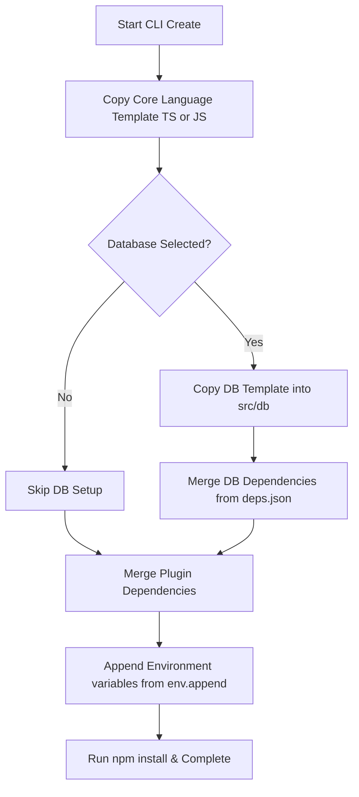

# 📂 Project Templates & Directory Layout

Exon CLI creates clean, scalable, and standard-compliant folder layouts optimized for both small projects and large, high-traffic production backends.

---

## 🏗️ Supported Template Frameworks

Exon CLI ships with native, optimized layouts located under the `templates/` folder. It maps your chosen language and database seamlessly.

<CardGroup cols={2}>
  <Card title="Base Engine Templates" icon="folder-tree">
    *   `node-express-template-js`: Modern ES Module JavaScript structure.
    *   `node-express-template-ts`: Type-safe TypeScript layout with pre-configured compilation files.
  </Card>
  <Card title="Database Templates" icon="database">
    Pre-configured db modules injected into `src/db/`:
    *   `mongoose`: Ready-to-go MongoDB client bindings.
    *   `prisma`: Prisma client setups and strict database typing schemas.
    *   `drizzle`: Drizzle schema bindings and database client connection settings.
  </Card>
</CardGroup>

---

## 📂 Production Folder Architecture

Regardless of your chosen stack, Exon constructs a unified, easy-to-navigate directory tree. Below is a detailed mapping of file responsibilities in a standard TypeScript project:

```txt
my-api/
├── src/
│   ├── controllers/      # Route controllers (handles incoming requests, parses payloads, returns responses)
│   ├── routes/           # Routing middleware mappings separating endpoint paths from execution logic
│   ├── middleware/       # Shared middleware logic (authenticator filters, global exception handlers)
│   ├── db/               # Database initialization configs and client connection instances
│   ├── models/           # DB schema modeling structures (Mongoose, Drizzle, or Prisma schemas)
│   ├── utils/            # Core utilities:
│   │   ├── apiError.ts   # Centralized error formatting classes for custom HTTP status codes
│   │   ├── apiResponse.ts# Centralized standard API success structures
│   │   └── asyncHandler.ts# Safe async try/catch wrapper preventing unhandled promise rejections
│   ├── socket/           # Realtime Socket.IO servers and connection rooms
│   ├── app.ts            # Core Express app setup, registering middlewares, plugins, and routings
│   └── index.ts          # Server entrypoint listening on network ports
```

---

## 🔄 The Scaffolding Pipeline

When you execute `exon-cli create <project-name>`, the compiler performs a multi-step compilation process to assemble your final workspace:



### 1. Project Base Replication
Copies the core JavaScript or TypeScript boilerplate matching your primary language choice.

### 2. Database Integration
If you select Mongoose, Prisma, or Drizzle, Exon pulls the corresponding database templates and copies them directly into the target `src/db` directory.

### 3. Dependency Aggregation (`deps.json`)
Rather than relying on outdated static list installations, Exon reads the `deps.json` file inside the database or plugin folder and dynamically appends them into your root `package.json` package map before installing.

### 4. Environmental Injection (`env.append`)
Pulls environment settings (e.g., `DATABASE_URL` configurations or logging profiles) from the template's `env.append` file and appends them cleanly to the root `.env` config file.

---

## 🛠️ Creating Custom Templates

If you wish to extend Exon's default outputs or design your own template styles:

1.  Navigate to the `templates/` directory.
2.  Add a new folder (e.g., `node-express-template-myframework`).
3.  Include a `deps.json` file containing any required packages.
4.  Include an `env.append` file defining any environment variables.
5.  Exon's internal compiler will automatically parse and merge your files when generated.
